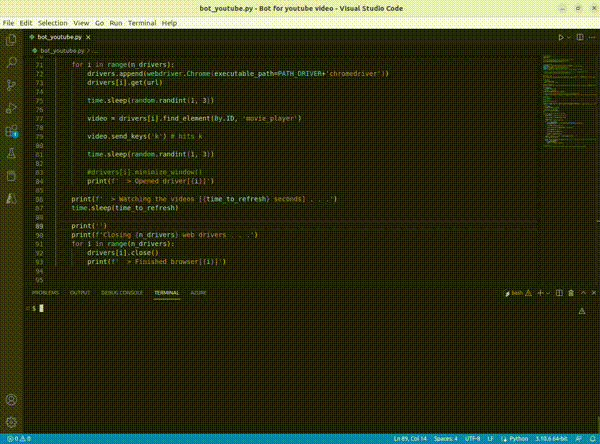

# Bot for watching video in YouTube

How to use:

**0.** Install a Python 3 and package Selenium (`pip install selenium`)

**1.** Run the Python script in your terminal:
```
python bot_youtube.py
```

<br/>

**2.** Select the link for the video in Youtube

<br/>

**3.** Type the duration of video in seconds (attention for the unit `seconds` (s))

<br/>

**4.** Choose the number of times  that the bot will watching the video (e.g., 2x or 3x for tests, 50x for large tests)

<br/>

**5.** Select the number of windows that will be open at same time for see your the video

<br/>

5. Waiting for the bot

<br/>


## Example:

<br/>

<div style="text-align: center;">
  
</div>

<br/>
